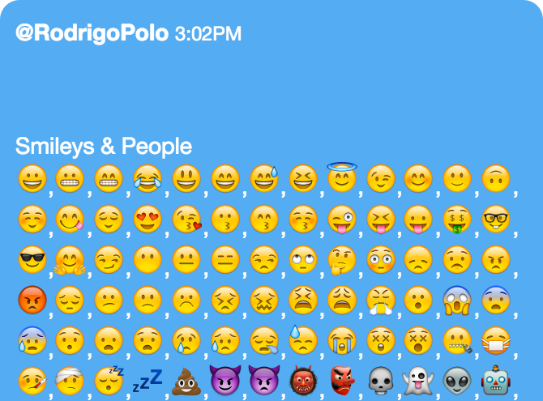

#minEmoji Collection

The smallest JavaScript/CSS libraries and jQuery Plug-ins to replace all new Emojis into CSS Sprite images using `<span>` and `` elements, Apple, Google/Android, Emoji One and Twitter Sprites included.

>**IMPORTANT** As from august 2016 I'll only keep the iOS/macOS version of jMinEmoji updated because trying to keep track of other emoji image assets is very time consuming, I'll release another git/npm/bower version focused only on the Apple version to keep things small and clean as it is the original purpose of this project.



### Latest
[minEmoji_iOS10 Demo](http://rodrigopolo.github.io/minEmoji/minEmoji_iOS10/demo.html)   

### Legacy (Old versions)
[jMinEmoji2 Demo](http://rodrigopolo.github.io/minEmoji/jMinEmoji2/demo.html)  
[minEmoji_iOS8 Demo](http://rodrigopolo.github.io/minEmoji/minEmoji_iOS8/demo.html)  
[jMinEmoji-SVG Demo](http://rodrigopolo.github.io/minEmoji/jMinEmoji-SVG/demo.html) Some SVGs are not available.  
[jMinEmoji Demo](http://rodrigopolo.github.io/minEmoji/jMinEmoji/demo.html)  
[minEmoji Demo](http://rodrigopolo.github.io/minEmoji/minEmoji/demo.html)  

###Special Notes:  
 1. jMinEmoji-SVG doesn't have all assets available on the latest iOS / OS X release, but Emoji One devs will release a new version soon.  
 2. Missing emojis on unfinished sprites are replaced with Apple emojis.
 3. If you use [TweetDeck.com](http://TweetDeck.com) and want all new emojis, use [this fork](http://bit.ly/TweetDeckEmojis) I made from [Better TweetDeck](https://github.com/eramdam/BetterTweetDeck) which uses minEmoji in order to replace and input emojis.


###jMinEmoji2 jQuery plugin:
iOS 9.1 ready, a simple solution using PNG Sprites, usage: Include the CSS and JS into your HTML and apply the `minEmoji()` function to any jQuery selector.

```html
<link href="css/minEmoji2.css" rel="stylesheet">
```

```html
<script src="http://code.jquery.com/jquery-1.11.0.min.js"></script>
<script src="js/jMinEmoji2.js"></script>
<script>
	$(function(){
		$('.txt').minEmoji();
	});	
</script>
```

**iOS and Apple Devices**: jMinEmoji doesn't replace Emoji on Safari, but you can force that behavior passing `true` to the function:

```javascript
$(function(){
	$('.txt').minEmoji(true);
});
```

###jMinEmoji-SVG jQuery plugin:

The jMinEmoji-SVG jQuery plugin is the perfect solutions for HiDPI displays, low bandwidth consumption; 127 bytes on CSS, 17.41KiB (not using gzip) on JavaScript, loading emojis on demand from very small numerically named SVG files.

Usage: Include the CSS and JS into your HTML and apply the `minEmojiSVG()` function to any jQuery selector.

```html
<link href="css/jMinEmoji-SVG.css" rel="stylesheet">
```

```html
<script src="//code.jquery.com/jquery-1.11.0.min.js"></script>
<script src="js/jMinEmoji-SVG.min.js"></script>
<script>
	$(function(){
		$('.txt').minEmojiSVG();
	});	
</script>
```

**iOS and Apple Devices**: jMinEmoji-SVG doesn't replace Emoji on Safari, but you can force that behavior with the `safari: true` option:

```javascript
$(function(){
	$('.txt').minEmojiSVG({ 
		safari:		false, 		// Force emoji replacement on Safari
		svg_path:	'img/svg/'	// Set the SVG image path
	});
});
```

###jMinEmoji jQuery plugin:
A simple solution using PNG Sprites, usage: Include the CSS and JS into your HTML and apply the `minEmoji()` function to any jQuery selector.

```html
<link href="css/minEmoji.css" rel="stylesheet">
```

```html
<script src="http://code.jquery.com/jquery-1.11.0.min.js"></script>
<script src="js/jMinEmoji.js"></script>
<script>
	$(function(){
		$('.txt').minEmoji();
	});	
</script>
```

**iOS and Apple Devices**: jMinEmoji doesn't replace Emoji on Safari, but you can force that behavior passing `true` to the function:

```javascript
$(function(){
	$('.txt').minEmoji(true);
});
```

###minEmoji:
For those who like to code without jQuery, usage: Include the CSS and JS into your HTML document and call the function `minEmoji(string)` to replace a desired text.

```html
<link href="css/minEmoji.css" rel="stylesheet">
```

```html
<script src="js/minEmoji.js"></script>
<script>
	$('#div').html(minEmoji(string));	
</script>
```

-------

###Why another library?

Here is a post with the huge emoji image source files and full explanation: 
http://rodrigopolo.com/codigo/minemoji-another-emoji-js-library.html

-------

### License

(The MIT License)

Copyright (c) by Rodrigo Polo http://RodrigoPolo.com

Permission is hereby granted, free of charge, to any person obtaining a copy
of this software and associated documentation files (the "Software"), to deal
in the Software without restriction, including without limitation the rights
to use, copy, modify, merge, publish, distribute, sublicense, and/or sell
copies of the Software, and to permit persons to whom the Software is
furnished to do so, subject to the following conditions:

The above copyright notice and this permission notice shall be included in
all copies or substantial portions of the Software.

THE SOFTWARE IS PROVIDED "AS IS", WITHOUT WARRANTY OF ANY KIND, EXPRESS OR
IMPLIED, INCLUDING BUT NOT LIMITED TO THE WARRANTIES OF MERCHANTABILITY,
FITNESS FOR A PARTICULAR PURPOSE AND NONINFRINGEMENT. IN NO EVENT SHALL THE
AUTHORS OR COPYRIGHT HOLDERS BE LIABLE FOR ANY CLAIM, DAMAGES OR OTHER
LIABILITY, WHETHER IN AN ACTION OF CONTRACT, TORT OR OTHERWISE, ARISING FROM,
OUT OF OR IN CONNECTION WITH THE SOFTWARE OR THE USE OR OTHER DEALINGS IN
THE SOFTWARE.

###Emoji One assets License
Attribution required, use one of the following:
* Emoji provided free by [Emoji One](http://emojione.com/)
* Emoji provided free by http://emojione.com
* Emoji set designed and offered free by [Emoji One](http://emojione.com/)

###Twitter Emoji assets License
Copyright 2014 Twitter, Inc and other contributors
Graphics licensed under CC-BY 4.0: https://creativecommons.org/licenses/by/4.0/

